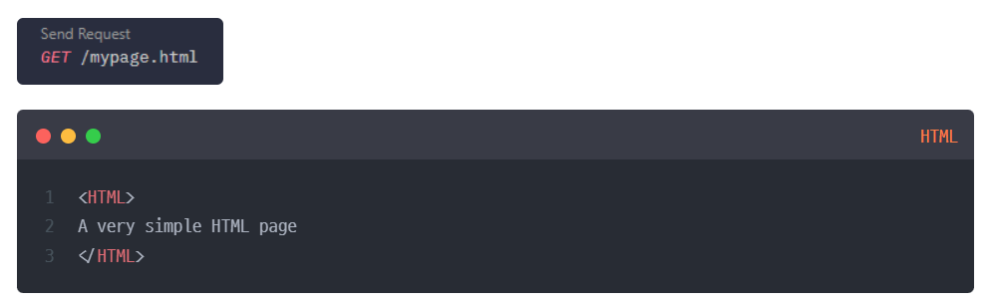
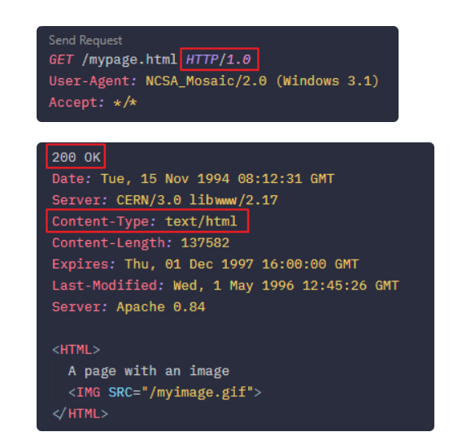

# HTTP/1.0, HTTP/1.1, HTTP/2, HTTP/3 그리고 QUIC 정리

출처: [HTTP/1.0, HTTP/1.1, HTTP/2.0, HTTP/3.0, and QUIC](https://velog.io/@minu/HTTP1.0-HTTP1.1-HTTP2-and-QUIC)

## 한눈에 보는 흐름

HTTP는 웹에서 클라이언트와 서버가 데이터를 주고받기 위한 애플리케이션 계층 프로토콜이다. 초기 HTTP는 단순한 문서 전달에 가까웠지만, 웹이 이미지, CSS, JavaScript, 비동기 요청 등 많은 리소스를 다루게 되면서 성능 문제가 점점 커졌다.

HTTP의 발전은 크게 다음 문제를 줄이는 방향으로 이어졌다.

- 매 요청마다 연결을 새로 맺는 비용
- 요청과 응답이 순서에 묶여 지연되는 문제
- 반복적으로 전송되는 무거운 헤더
- TCP 연결 설정과 패킷 손실로 인한 지연

## HTTP/0.9

기존 HTTP 0.9는 GET 메서드만 지원하고, HTTP 헤더나 상태코드도 없었다. 또한 오로지 HTML 파일만 받기 위해 사용했다.

## HTTP/1.0

HTTP/1.0은 HTTP/0.9와 달리 HTML뿐 아니라 이미지, CSS 같은 다양한 파일을 전달할 수 있도록 확장되었다. (응답 헤더가 추가되었기 떄문, Content-Type)
또한 GET/POST/UPDATE 같은 메서드가 추가되었으며, 상태코드, 요청/응답 헤더가 추가되었다.

다만 기본적으로 하나의 TCP 연결에서 하나의 요청과 응답만 처리하는 방식이어서, 리소스 하나를 받을 때마다 연결을 새로 맺고 끊는 비용이 컸다. 페이지에 포함된 리소스가 많아질수록 TCP 세션 생성과 종료가 반복되고, RTT(Round Trip Time)가 증가하면서 응답 속도가 느려졌다.

주요 한계는 다음과 같다.

- 요청마다 새로운 TCP 연결이 필요해 성능이 떨어진다.
- 하나의 연결에서 하나의 요청만 처리하기 때문에 동시 전송이 어렵다.
- 서버 연결 비용과 네트워크 지연이 커진다.
- Host 헤더가 표준적으로 사용되지 않아 하나의 IP에서 여러 도메인을 운영하기 어렵다.

이런 문제를 줄이기 위해 이미지 스프라이트, 코드 압축, Base64 인코딩 같은 최적화 기법이 사용되었다.
![[Pasted image 20260514124154.png]] 

## HTTP/1.1

HTTP/1.1의 핵심 개선은 TCP 연결을 재사용하는 것이다. HTTP/1.0에서도 지속 연결 개념이 일부 지원되었지만, HTTP/1.1에서 더 표준적인 기능으로 자리 잡았다.

![[Pasted image 20260514124520.png]]
### 주요 특징

#### Persistent Connection

지정된 timeout 동안 TCP 연결을 닫지 않고 유지한다. 하나의 TCP 세션으로 여러 리소스를 요청할 수 있어, 매 요청마다 연결을 새로 맺던 HTTP/1.0보다 서버 부하와 응답 지연을 줄일 수 있다.

#### Pipelining

하나의 연결 안에서 응답을 기다리지 않고 여러 요청을 순차적으로 보낸 뒤, 요청 순서에 맞춰 응답을 받는 방식이다. 이론적으로는 지연 시간을 줄일 수 있지만, 구현이 까다롭고 Head of Line Blocking 문제가 남는다.

#### Host Header

Host 헤더가 추가되면서 하나의 IP 주소에서 여러 도메인을 운영하는 가상 호스팅이 가능해졌다.

#### 인증 절차 개선

프록시 환경에서 인증을 처리하기 위한 `proxy-authentication`, `proxy-authorization` 헤더가 추가되었다.

### 한계

HTTP/1.1은 HTTP/1.0보다 효율적이지만, 여전히 구조적인 병목이 있다.

- **Head of Line Blocking**: 앞선 요청이나 패킷 처리에 문제가 생기면 뒤의 요청도 함께 지연된다. - 왜? TCP기때문에
- **무거운 헤더**: 요청마다 비슷한 헤더와 쿠키 정보가 반복 전송되어 네트워크 자원을 낭비한다.
- **Pipelining의 현실적 한계**: 응답 순서를 유지해야 하므로 병목 문제를 완전히 해결하지 못한다.

## HTTP/2

HTTP/2는 기존 HTTP의 의미 구조를 유지하면서 전송 성능을 개선한 버전이다. 2015년에 등장했으며, Google의 SPDY를 기반으로 한다.

HTTP/2의 목표는 새로운 웹 기능을 추가하는 것보다 HTTP/1.x의 성능 문제를 개선하는 데 있다.

https://www.httpvshttps.com/
### 주요 특징

#### Binary Framing

HTTP 메시지를 텍스트가 아닌 바이너리 프레임 단위로 나누어 전송한다. 이를 통해 파싱과 전송 효율을 높이고 오류 가능성을 줄인다.

#### Multiplexing

하나의 연결에서 여러 요청과 응답을 동시에 주고받을 수 있다. 응답은 요청 순서와 독립적으로 스트림 단위로 처리된다. 이 덕분에 HTTP/1.1의 파이프라이닝보다 효율적으로 병렬 처리가 가능하다.

#### Stream Prioritization

리소스별 우선순위를 지정할 수 있다. 브라우저는 중요한 리소스를 먼저 받을 수 있도록 서버에 우선순위 정보를 전달할 수 있다.

#### Server Push

클라이언트가 명시적으로 요청하기 전에 서버가 필요할 것으로 예상되는 리소스를 미리 보낼 수 있다. 목적은 추가 요청에 필요한 대기 시간을 줄이는 것이다.

![[Pasted image 20260514124729.png]]

#### Header Compression

HTTP/1.1에서 반복 전송되던 헤더를 HPACK 방식으로 압축한다. 클라이언트와 서버는 헤더 테이블을 관리하고, 반복되는 필드는 전체 값을 다시 보내는 대신 인덱스 등을 활용해 헤더 크기를 줄인다.

![[Pasted image 20260514124740.png]]
### 남은 문제

HTTP/2는 HTTP 레벨의 Head of Line Blocking을 크게 완화했지만, TCP 위에서 동작하기 때문에 TCP 레벨의 Head of Line Blocking은 여전히 남아 있다. TCP 패킷이 손실되면 해당 연결의 데이터 재조립이 지연되고, 그 연결 위의 여러 스트림도 영향을 받을 수 있다.

## HTTP/3

HTTP/3는 HTTP/2의 장점인 멀티플렉싱을 유지하면서, 전송 계층을 TCP가 아닌 QUIC으로 바꾼 버전이다. QUIC은 UDP 기반으로 동작한다.

네이버는 Http/2와 3 혼용, google은 HTTP3만 사용

HTTP/3의 주요 특징은 다음과 같다.

- QUIC 위에서 동작한다.
- TCP가 아닌 UDP 기반이다.
- HTTPS 사용을 전제로 한다.
- 초기 연결 설정 지연을 줄이는 데 초점이 있다.
- HTTP/2의 TCP 레벨 Head of Line Blocking 문제를 완화한다.

## QUIC

QUIC(Quick UDP Internet Connections)은 Google이 공개한 UDP 기반 전송 계층 프로토콜이다. TCP의 신뢰성 있는 전송 특성을 유지하면서도 연결 설정과 패킷 손실에 따른 지연을 줄이는 방향으로 설계되었다.

### UDP를 선택한 이유

TCP는 신뢰성을 제공하지만 연결 설정과 순서 보장 때문에 지연을 줄이기 어렵다. 반면 UDP는 기본 기능이 단순하므로, 애플리케이션이 필요한 신뢰성, 암호화, 흐름 제어 등을 직접 설계해 넣기 좋다.

QUIC은 UDP 위에서 다음과 같은 기능을 제공한다.

- 연결 설정 지연 감소
- TLS 기본 적용
- 패킷 손실 시 영향 범위 축소
- 독립 스트림 기반 멀티플렉싱
- IP 변경 상황에서도 연결 유지 가능
- QPACK 기반 헤더 압축

### 주요 장점

#### 빠른 연결 설정

QUIC은 첫 연결 과정에서 필요한 정보와 데이터를 함께 보낼 수 있다. 한 번 연결이 성공하면 설정 정보를 캐싱해 다음 연결을 더 빠르게 시작할 수 있다.

#### Connection ID

QUIC은 IP와 포트 조합 대신 Connection ID를 사용해 연결을 식별할 수 있다. 이 덕분에 모바일 환경처럼 네트워크가 바뀌는 상황에서도 연결을 더 유연하게 유지할 수 있다.

#### 기본 TLS

QUIC은 TLS를 기본으로 포함한다. 보안 연결을 전제로 설계되어 스푸핑, 재전송 공격 같은 위험을 줄이는 데 도움이 된다.

#### 독립 스트림

QUIC의 스트림은 독립적으로 동작한다. 특정 스트림에서 패킷 손실이 발생해도 다른 스트림 전체가 함께 막히는 문제를 줄일 수 있다.

## 버전별 비교

| 구분 | 기반 전송 | 핵심 개선 | 남은 한계 |
| --- | --- | --- | --- |
| HTTP/1.0 | TCP | 다양한 리소스 전송 | 요청마다 연결 비용 큼 |
| HTTP/1.1 | TCP | 지속 연결, Host 헤더, 파이프라이닝 | HOL Blocking, 반복 헤더 |
| HTTP/2 | TCP | 바이너리 프레이밍, 멀티플렉싱, 헤더 압축 | TCP 레벨 HOL Blocking |
| HTTP/3 | QUIC over UDP | 빠른 연결 설정, 독립 스트림, TLS 기본 적용 | QUIC 지원 환경 필요 |

## 핵심 정리

HTTP/1.0은 매 요청마다 연결을 새로 맺는 비용이 컸고, HTTP/1.1은 지속 연결과 파이프라이닝으로 이를 개선했다. 하지만 요청 순서와 TCP 특성 때문에 Head of Line Blocking 문제가 남았다.

HTTP/2는 바이너리 프레이밍, 멀티플렉싱, 헤더 압축으로 HTTP 레벨의 병목을 크게 줄였다. 그러나 TCP 위에서 동작하기 때문에 패킷 손실 시 연결 전체가 영향을 받는 문제는 완전히 해결하지 못했다.

HTTP/3는 전송 계층을 QUIC으로 바꾸면서 이 문제를 더 줄이려 한다. QUIC은 UDP 기반이지만 TLS, 신뢰성, 스트림 제어를 자체적으로 제공하며, 빠른 연결 설정과 독립 스트림을 통해 현대 웹 환경에 더 적합한 성능 특성을 제공한다.
