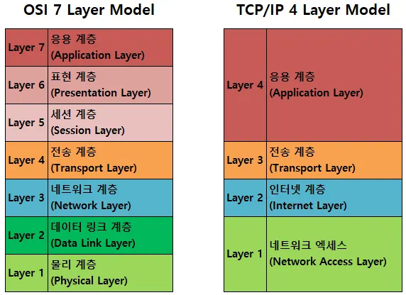

## OSI 7 계층

#### OSI 7계층이란?

OSI 7 계층은 네트워크에서 통신이 일어나는 과정을 7단계로 나눈 것을 말한다. 

#### OSI 7계층을 왜 나누었을까?

통신이 일어나는 과정을 단계별로 알 수 있고, 특정한 곳에 이상이 생기면 그 단계만 수정할 수 있기 때문이다.

#### OSI 7계층 전체 구조

1. 물리(Physical)

   - 네트워크 기본 하드웨어 전송기술이다.

   - 데이터를 전기적 신호로 변환하여 케이블과 같은 전송 매체를 통해 보내는 역할을 한다.

   - 단지 데이터를 전달만 할 뿐 전송하려는(또는 받으려는)데이터가 무엇인지, 어떤 에러가 있는지 등은 전혀 신경 쓰지 않는다.

   - 장비 : 리피터, 케이블, 허브 등

2. 데이터 링크(Data Link)

   - 물리계층을 통해 송수신되는 정보의 오류와 흐름을 관리하여 안전한 정보의 전달을 수행할 수 있도록 도와주는 역할을 한다.

   - 따라서 통신에서의 오류도 찾아주고 재전송도 하는 기능을 한다.

   - 맥 주소를 가지고 통신하며, 전송 단위는 프레임 이라고 한다.

   - 장비 : 브릿지, 스위치 등

3. 네트워크(Network)
   - 이 계층에서 가장 중요한 기능은 **데이터를 목적지까지 가장 안전하고 빠르게 전달하는 라우팅 기능**이다.

   - 라우터를 통해 이동할 경로를 선택하여 IP 주소를 지정하고, 해당 경로를 따라 패킷을 전달한다.
      -  라우팅 프로토콜 : RIP, OSPF, BGP

   - IP 주소를 기반으로 데이터를 목적지 네트워크까지 전달하며, 서로 다른 네트워크 간 통신을 가능하게 하는 계층이다.

   - 신뢰성을 제공하지 않는다.

   - 장비 : 라우터, L3 스위치

4. 전송(Transport)
   
   - 전체 메시지의 전송을 관리한다.

   - 신뢰성 있는 데이터 전송을 보장하기 위해 포트 번호를 사용하여 통신을 관리하며, 오류 복구 및 흐름 제어를 수행한다.

   - Segmentation : 메시지가 클 경우 이를 나눠서 네트워크 계층으로 전달하고, 받은 패킷을 재조립해서 상위 계층으로 전달한다.
   
   - 전송 계층은 특정 연결의 패킷들의 전송이 유효한지 확인하고 전송이 실패한 패킷을 다시 전송한다.
   
   - TCP, UDP 프로토콜이 대표적이다.
      - TCP : 연결 지항적으로 통신하며, 패킷 손실, 중복, 순서 바뀜 등이 없도록 신뢰성을 보장한다.
      - UDP : 비연결적으로 통신하며, 신뢰성을 보장하지 않는다. 헤더가 단순하며 빠른 요청과 응답이 필요한 실시간 응용에 적합하다.

   - 장비 : L4 로드밸런서, L4 스위치

5. 세션(Session)

   - 응용 프로그램 간의 통신 세션을 설정, 관리, 종료하는 역할을 한다.

   - 데이터 교환을 위한 논리적 연결을 담당하며, 통신이 중단된 경우 복구하는 기능을 제공한다.

   - 데이터를 상대방이 보내고 있을때 동시에 보낼지에 대한 반이중, 전이중 통신을 결정할 수 있다.

6. 표현 계층(Presentation Layer)

   - 응용 프로그램이 주고받는 데이터의 표현 방식을 변환하는 계층이다.

   - 서로 다른 시스템이나 응용 프로그램이 데이터 표현 방식에 의존하지 않고 통신할 수 있도록 도와준다.

   - 송신 측에서는 응용 프로그램의 데이터를 네트워크로 전송하기 적절한 형태로 변환하고, 수신 측에서는 받은 데이터를 응용 프로그램이 이해할 수 있는 형태로 다시 변환한다.

   - 주요 역할은 인코딩, 디코딩, 압축, 압축 해제, 암호화, 복호화이다.

   - 예시 : JPEG, MPEG, ASCII, UTF-8, SSL/TLS

7. 응용(Application)

   - 사용자와 가장 가까운 계층으로, 응용 프로그램이 네트워크 기능을 사용할 수 있도록 서비스를 제공한다.

   - HTTP, HTTPS, FTP, SMTP, POP3, IMAP, Telnet, DNS 등과 같은 프로토콜이 응용 계층에 해당한다.

   - 웹 브라우저, 이메일 클라이언트, 파일 전송 프로그램처럼 실제 사용자가 접하는 프로그램들이 이 계층의 프로토콜을 이용해 통신한다.

   - 백엔드 개발자가 주로 다루는 HTTP API도 응용 계층에 해당한다.

#### 백엔드 개발자가 잘 알아야 할 계층

   - **응용 계층**
      - 백엔드 개발자가 가장 직접적으로 다루는 계층이다. 
      - HTTP, HTTPS, DNS 같은 프로토콜이 여기에 해당하며, 우리가 만드는 REST API도 응용 계층과 관련이 있다.
      - HTTP 메서드, URL, Header, Body, 상태 코드, 쿠키, 세션, CORS 같은 개념은 모두 백엔드 개발자가 자주 다루는 내용이다.

   - **전송 계층**
      - TCP, UDP, 포트 번호와 관련된 계층이다.
      - 서버는 특정 포트에서 클라이언트의 요청을 기다리고, 클라이언트는 IP 주소와 포트 번호를 통해 서버의 특정 애플리케이션에 접근한다. (예 : Spring Boot 서버 8080)
      - 연결 실패, 타임아웃, 포트 충돌, L4 로드밸런싱 같은 문제를 이해하려면 전송 계층에 대한 이해가 필요하다.

   - **네트워크 계층**
      - IP 주소와 라우팅을 담당하는 계층이다. 
      - 클라이언트의 요청이 서버까지 도달하려면 목적지 IP를 기준으로 여러 네트워크를 거쳐 이동해야 한다.
      - 서버 배포 과정에서 자주 접하는 IP, 라우팅, 서브넷, VPC, NAT, 방화벽, 보안 그룹 같은 개념은 네트워크 계층과 관련이 깊다.
